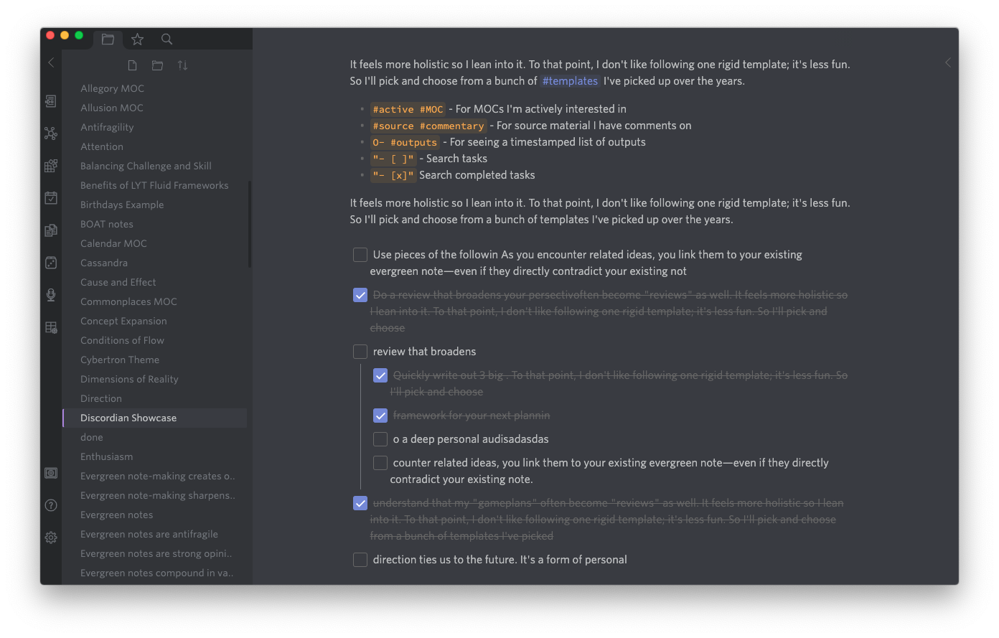
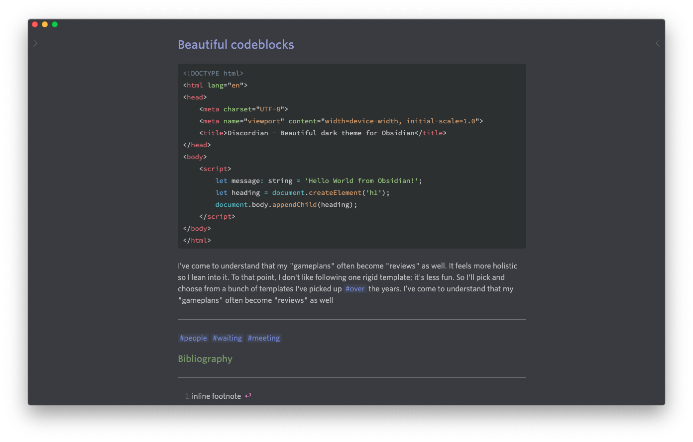
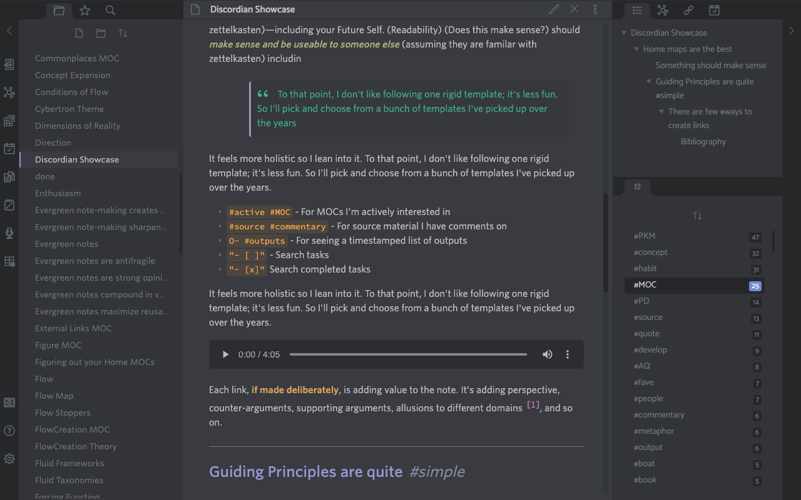
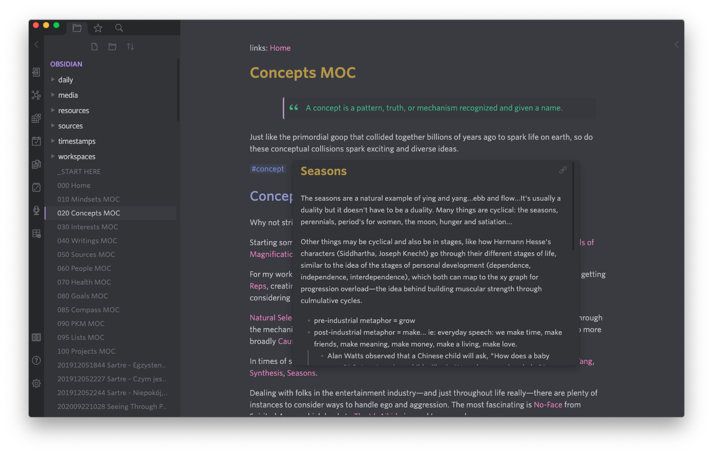

## beautiful Obsidian dark theme inspired by Discord 

Discordian is a dark theme designed to give all [Obsidian](https://obsidian.md) power users visuals they recognize and appreciate 
when gathering on Discord servers to discuss all things Obsidian. **Seamless Discord experience right back in Obsidian** 
is the keyword here. We, Obsidianites, PKM & Zettelkasten lovers, spend there so much time it's almost logical 
to have the same visual experience extended to our beloved app ([see screenshots](#screenshots))   

Discordian theme, apart from deriving its visuals from Discord app, strives to serve as solid dark theme. An honest default. 
This means it offers an unobtrusive, minimal and easy on the eyes experience with a hint of subtle changes in 
Discord's color palette like muting and pastelizing some colors.

Of course, it fully supports [popular Obsidian's community plugins](#plugin-support) but also has its own 
[Discordian Plugin](https://github.com/radekkozak/discordian-plugin) going on which is very much recommended. 
If you like to have more fine-grained control over some aspects of the theme go ahead and download it. 
You will be so much happier with the additions of Writer Mode, Paragraph Focus, Flat Andy's Mode, controllable 
line length and other things.

## Small Disclaimer

Discordian theme is provided *as is*, meaning it is a product of my own personal experience, and it's the way 
I use Obsidian app on daily basis on my trusty macOS. Please bear in mind that even though it was created from 
my personal use i did my best to polish it enough to be used with the latest version of Obsidian but the quirks 
and some visual discrepancies may occur as I had no means of testing it on other platforms. 
  
As this theme modifies many parts of Obsidian UI it's given that it might break some things with future 
app updates or with your own css snippets. I do however plan to earnestly support it so as Obsidian app 
will progress so it will this Discordian theme. I am also open to any [contributions](#contribute) 
being a simple suggestion, bug report or fix via PR.    

## Features and goals

- Easy on the eyes, lean design with focus on clean visuals 
- Promotes writing experience first (Writer's mode, Paragraph Focus Mode as seen in iaWriter and the like). 
No UI excess necessary.  
- *Keyboard is an Obsidianite's best friend*. As Obsidian's power users we love us some keyboard shortcuts.
- Settings panel as seen in Discord (along with fancy toggle switches) 
- [Beautiful task list](#task-lists) - now also in editor's mode !
- **Beautiful graph view** (see [screenshots](#screenshots)) 
- **Naked transclusions**
- Bullet points relationship lines extravaganza as default
- Graceful dark theme audio (styled) in place of ugly default 
- New and improved code blocks with delightful pastel aesthetics

## Full plugin support

- [Sliding Panes](https://github.com/deathau/sliding-panes-obsidian) (aka Andy Mode)
- [Calendar Plugin](https://github.com/liamcain/obsidian-calendar-plugin)
- [Hider Plugin](https://github.com/kepano/obsidian-hider)

## Some additional remarks 

### Hidden things

To provide simple and clean UI that mimics Discord app Discordian theme hides top title bar and status bar as default. 
**You can however enable them and bring them back via accompanying** [Discordian plugin](https://github.com/radekkozak/discordian-plugin) 
(this is preferred way) or if you decide to go solo by commenting appropriate parts of CSS.

I could provide more user-controllable elements for hiding if requested but to not reinvent the wheel i sincerely recommend
excellent [Hider Plugin](https://github.com/kepano/obsidian-hider) by @kepano - i use it myself for simplifying UI
even more. Discordian of course is, as mentioned before, fully compatible with it.

### Task lists

The way the fancy task lists works in editor mode as well is via quite `hackish` means. Therefore, it's mandatory 
to have `Smart indent list` option enabled in Obsidian. From my own experience I would also recommend having 
`Toggle checklist status` under some hotkey. This would definitely make working with tasks / checklist list a blaze.
I know I love it that way! If needed one can also revert to defaults via plugin.  

## Screenshots

based on [Nick Milo](https://github.com/nickmilo) 's [LYT Kit](https://www.linkingyourthinking.com)

### Discord experience 

### Beautiful codeblocks

### Editor in Writer Mode

### Feature showcase in Full Mode

### Other

## Contribute

Found some quirks? Want to propose some new functionality? 
You can easily follow these simple steps:

1. [File an issue](https://github.com/radekkozak/discordian/issues/new) discussing proposed changes or found bug
2. If you want to contribute solution on your own please
    - clone this repo
    - `npm i` to install dependencies
    - `npm run dev` to start compilation in watch mode
    - do your magic
    - use commit message that best describes changes you've just made. If possible, *link it to relevant issue*  
3. Wait for my swift response or PR for eventual merge

## Credits

Many ideas and css solutions are inspired by or come from an amazing Obsidianites both on 
[Obsidian's Forum](http://forum.obsidian.md/) and Discord channel: @kepano @death_au @nickmilo @tallguyjenks 
to name a few. Thanks to all of you for an amazing shared knowledge and community.  

## License

[MIT License](./LICENSE)