small tweaks by me, kept original feel and colors, but removed a lot of stuff, such as the settings styling, to my own liking

but now it is useable in Obsidian 1.x

to use: just download obsidian.css and add it to your snippets folder


---


## beautiful Obsidian dark theme inspired by Discord

Discordian is a dark theme designed to give all [Obsidian](https://obsidian.md) power users visuals they recognize
and appreciate when gathering on Discord servers to discuss all things Obsidian. **Seamless Discord experience right
back in Obsidian** is the keyword here. We, Obsidianites, PKM & Zettelkasten lovers, spend there so much time it's
almost logical to have the same visual experience extended to our beloved app ([see screenshots](#screenshots))

Theme, apart from deriving its visuals from Discord app, strives to serve as solid dark theme. An honest default
. This means it offers an unobtrusive, minimal and easy-on-the-eyes experience with a hint of subtle changes in
 Discord's color palette.

Discordian, of course, fully supports [popular Obsidian's community plugins](#plugin-support) but also has its own
[Discordian Plugin](https://github.com/radekkozak/discordian-plugin) going on which is very much recommended. If you
like to have more fine-grained control over some aspects of the theme go ahead and download it. You will be so much
happier with the **additions of Writer Mode, Paragraph Focus, Flat Andy's Mode**, controllable line length, fonts and
other things.

**IMPORTANT**: For best experience possible, **please** [download the fonts](https://github.com/radekkozak/discordian/raw/master/media/fonts.zip)
**and install them in your system before using the theme.** Provided fonts closely resemble those in Discord app and
are sort of required here.

## Disclaimer

Discordian theme is provided *as is*, meaning it is a product of my own personal experience, and shows the theme as I
use it in Obsidian app on daily basis within macOS environment. Please bear in mind that even though I did my best to
polish it enough to be used with the latest version of Obsidian some quirks and visual discrepancies may (or not
) occur as I had no means of testing it on other platforms.

As this theme modifies many parts of Obsidian UI it's given that it might break some things with future app updates
or with your own css snippets. However, I do plan to earnestly support it so as Obsidian app will progress so it will
Discordian theme. I am also open to any [contributions](#contribute) : be it a simple suggestion, bug report or your
fix via PR.

## Features and goals

- Easy on the eyes, lean design with focus on clean visuals (see [screenshots](#screenshots))
- Promotes writing experience first (Writer Mode, Paragraph Focus Mode).
- *Keyboard as Obsidianite's best friend* (as power users we love us some keyboard shortcuts)
- **Settings panel as seen in Discord** (along with fancy toggle switches)
- [Pretty Task lists](#task-lists) - **also in Editor mode** !
- **Beautiful graph view**
- **Seamless transclusions**
- Snappy performance (stripped out many animations)
- [**Images enhancements**](#images-enhancements) : **image grids, zooms, floating images with captions !!**
- Bullet points relationship lines extravaganza as default
- Graceful dark theme audio in place of ugly default
- New and improved **codeblocks with delightful aesthetics**

## Plugin support

- [Sliding Panes](https://github.com/deathau/sliding-panes-obsidian) (aka Andy Mode)
- [Calendar Plugin](https://github.com/liamcain/obsidian-calendar-plugin)
- [Hider Plugin](https://github.com/kepano/obsidian-hider)
- [Advanced Tables](https://github.com/tgrosinger/advanced-tables-obsidian)
- [Emoji Toolbar](https://github.com/oliveryh/obsidian-emoji-toolbar)

## Some additional remarks

### Hidden things

To provide simple and clean UI that mimics Discord app Discordian theme hides top title bar and status bar as default
. **You can however enable them and bring them back via accompanying** [Discordian plugin](https://github.com/radekkozak/discordian-plugin) (this is preferred way) or, if you decide to go solo, by commenting appropriate parts of CSS.

I could provide more user-controllable elements for hiding if requested but to not reinvent the wheel i sincerely
recommend excellent [Hider Plugin](https://github.com/kepano/obsidian-hider) by @kepano - I use it myself for
simplifying UI even more. Discordian of course, as mentioned before, is fully compatible with it.

### Task lists

The way the fancy task lists works in editor mode is via quite **hackish** means. Therefore, it's mandatory to have
`Smart indent list` option enabled in Obsidian. From my own experience I would also recommend having `Toggle
checklist status` under some hotkey. This would definitely make working with tasks / checklist list a blaze. I know I
 love it that way!

### Images enhancements

**NOTICE: as of version 0.11.3 Obsidian changed the way images are grouped which made the flexbox approach provided
by Discordian's image grids no longer possible**.

Not wanting to deprecate this feature which everyone seems to really like i decided to use @Lithou idea and hackishly
  make it work again with the theme - **some restrictions apply**. Unfortunately with new version of Obsidian there is
   no way to make the grid images on the same line of same height (like before). **Although current solution may look
   similar or even the same depending on images, it will now look and behave more like masonry-ish grid**.

#### Image grids

Using Obsidian's new `cssclass` directive in YAML you can achieve image grids like below with

```md
---
cssclass: img-grid
---
```

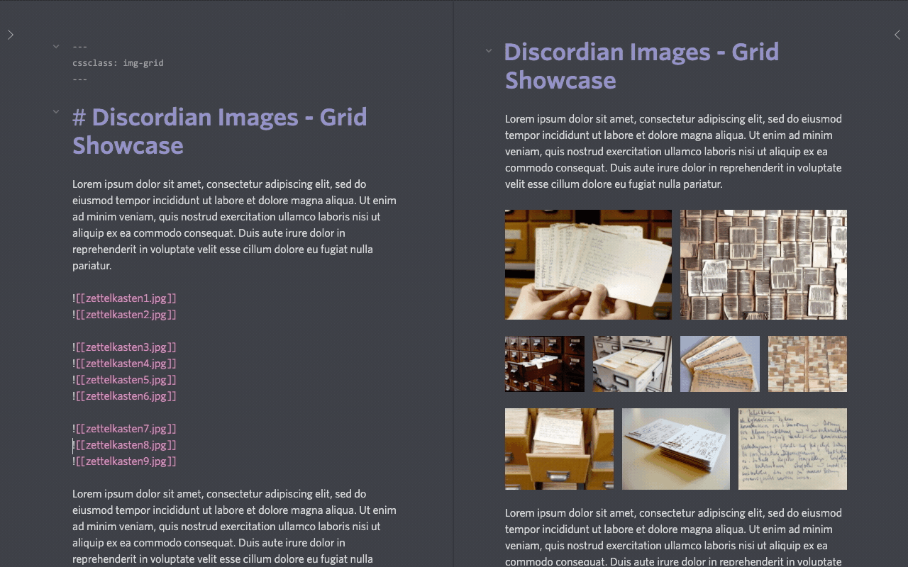

**RESTRICTIONS**: This works with images if

1. no pipe is used when calling an image i.e. `![[example.jpg]]` - **recommended default and simplest way**
2. or if your alt text in pipe contains a period `.` i.e `![[example.jpg|Figure 1. Some caption]]` (it will not
display the caption though if using `cssclass: img-grid` alone)

**EXPLANATION:** when no pipe is used (meaning no custom alt attribute is added by the user, Obsidian will made the
alt attribute equal to the `filename.ext`. **Image grids feature targets exactly those image embeds with an alt
attribute that has a period in it - ANY SUCH IMAGE**. This is the only possible solution for now after Obsidian 0.11.3 changes.

#### Floating images - with captions !! (work as before)

Have your images the way you want: full in center (*default*) or floating left or right with your text wrapped around
 them. **No messing around with HTML markups**, no polluting your markdown. **Fully using current Obsidian image
 embeds syntax** along with image resizing.

Using Obsidian's new cssclass directive in YAML you can have properly looking captions

```md
---
cssclass: img-captions
---
```

and then in your note you can do

`![[filename.png#position|caption|size]]`

_options_
- **position**: `left` or `right` (omitting assumes default which is center)
- **caption**: simply your caption (**note**: no markdown within caption and **no period**)
- **size**: `width x height` as explained in [Obsidian Help](https://publish.obsidian.md/help/How+to/Embed+files#Resize+images)

_NOTE_: **positioning** `left` or `right` **and resizing** is working _EVEN WITHOUT YAML_ directive. `cssclass` is
 only for still allowing simple embeds without polluted captions (Obsidian fills image `alt` with filename by default)

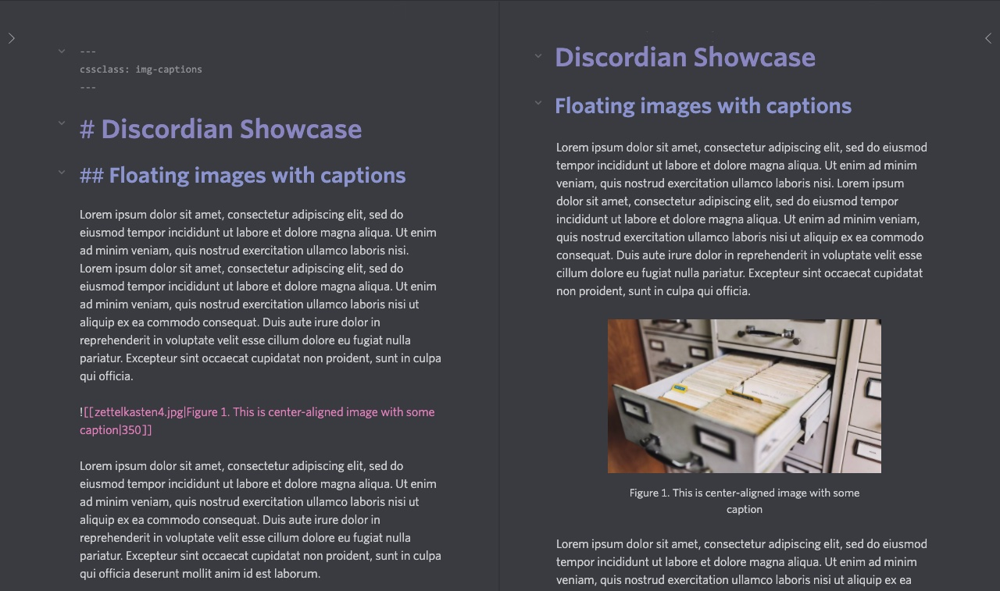

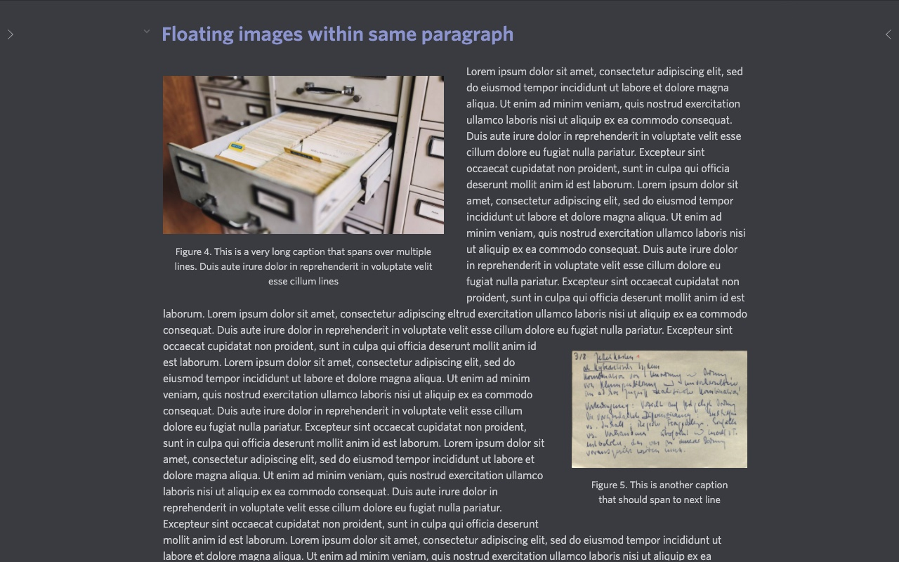

#### Image grids AND image captions IN ONE NOTE (Discordian v0.8.6+)

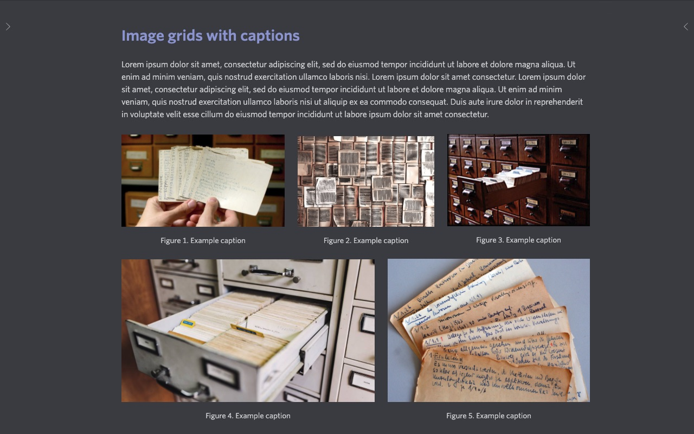

Before version 0.8.6 (and prior to Obsidian 0.11.3 changes) i advised everyone to use `img-grid` or `img-captions`
separately as CSS in those features is applied globally to all images in the note.

**From version 0.8.6 of Discordian theme** - with some restrictions - **you can have both image grids and image
captions in one note** - BUT please consider this feature more or less experimental.

```md
---
cssclass: img-grid, img-captions
---
```

**RESTRICTIONS** (only for both features together):

1. Images with image captions in the same note cannot have period in it (see how [**Image grids**](#image-grids) work
 now)
2. Images within image grids with no piped caption text from user will display `filename.ext` per Obsidian's default
behaviour).
3. If you want your images within image grids with your custom captions then use your piped caption WITH period `.`
in it. You can simply make it the end of your sentence or sth like this

```md
![[example.jpg|Figure 1. Example caption]]
```

**NOTE**: I still advise using these image features in your notes separately. It will make your life easier and save
your from headache of remembering the inner workings.

---

#### Image zooms

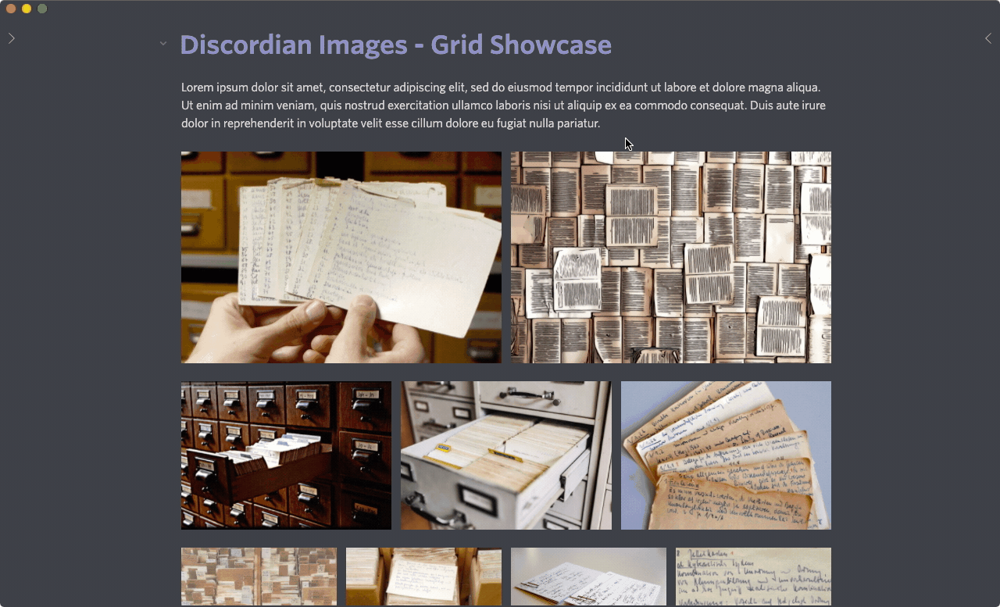

## Screenshots

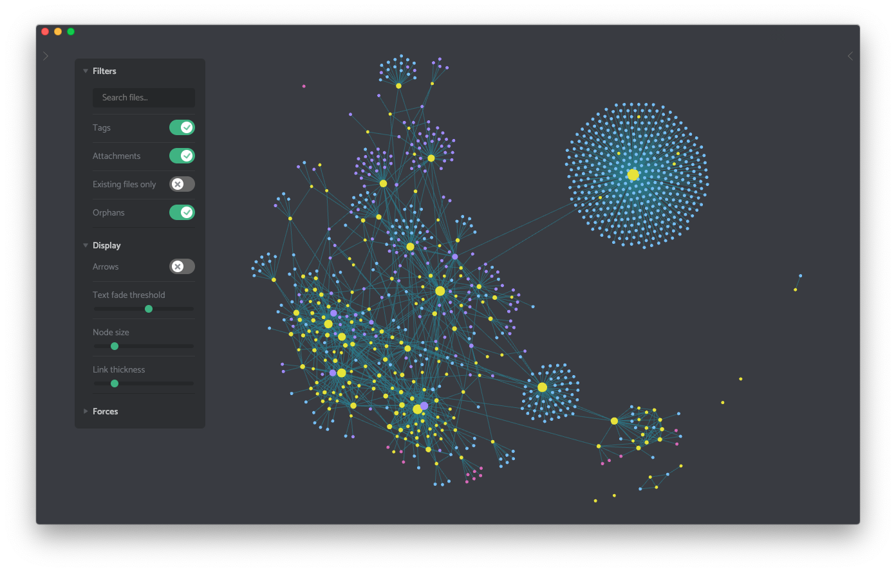

### Discord experience

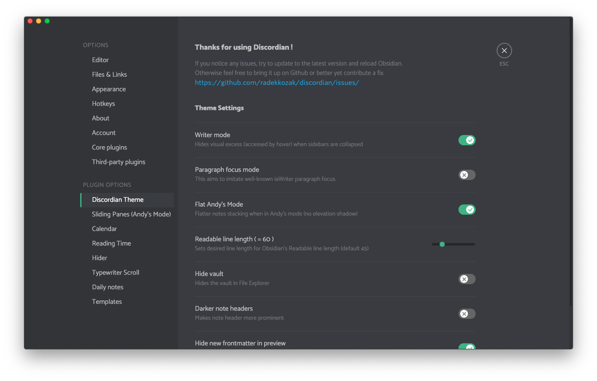

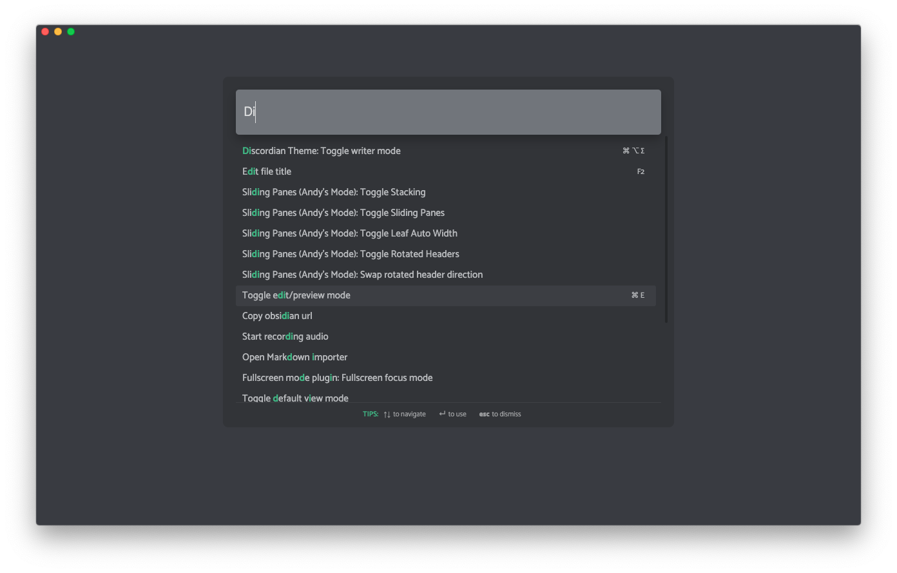

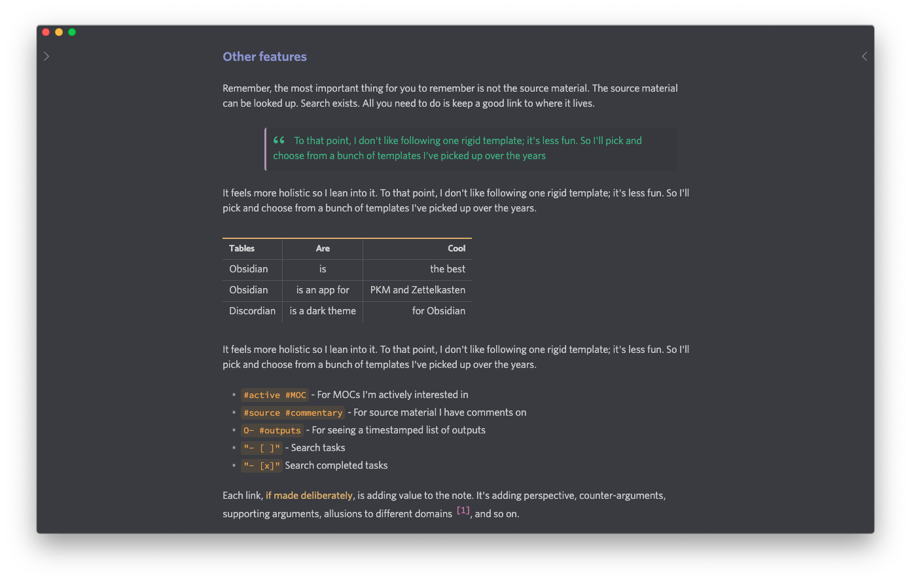

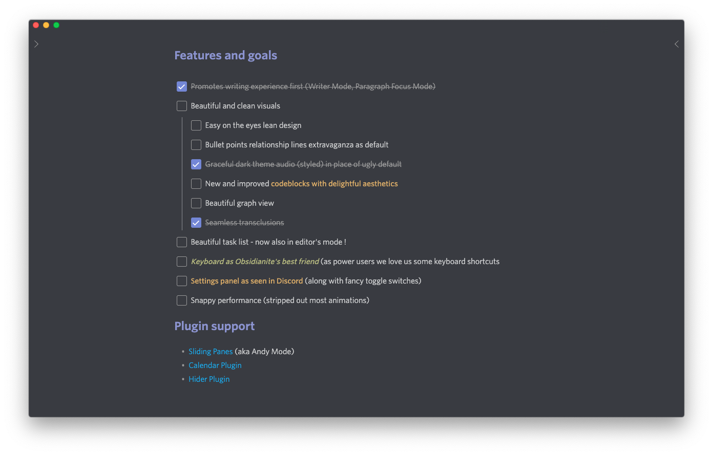


### Discordian in Andy Mode (fullscreen)

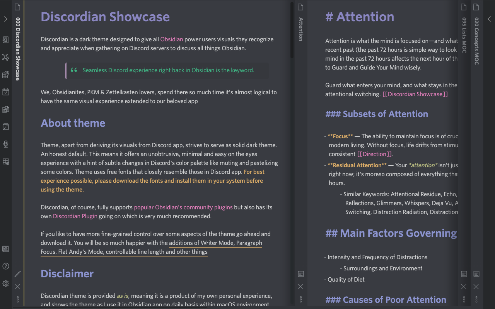

### Discordian in Writer Mode

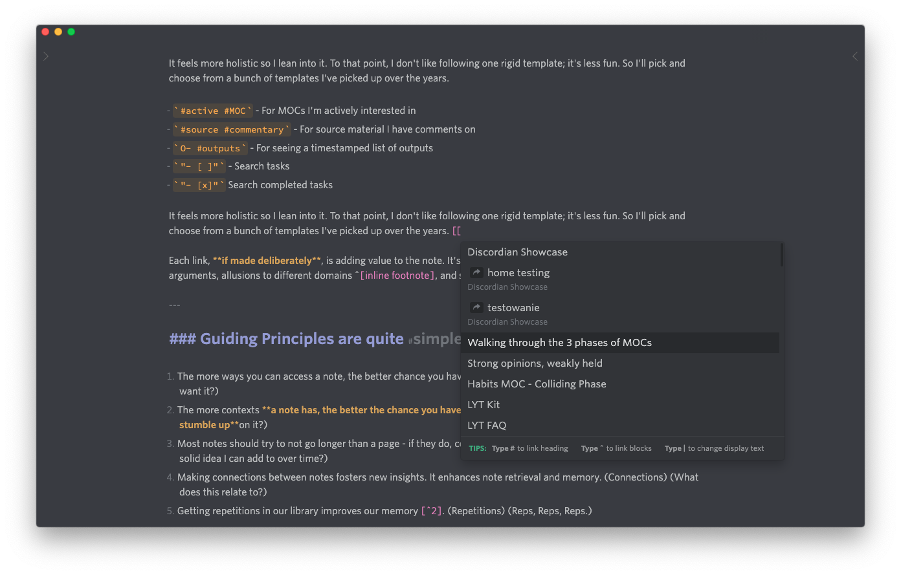

### Discordian in Fullscreen

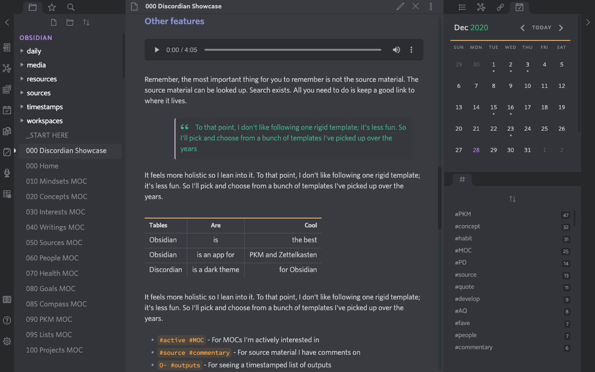

## Contribute

Found some quirks? Want to propose some new functionality?
You can easily follow these simple steps:

1. [File an issue](https://github.com/radekkozak/discordian/issues/new) discussing proposed changes or found bug
2. If you want to contribute solution on your own please
    - clone this repo
    - `npm i` to install dependencies
    - create `config.json` from `config.json.example` and set it accordingly
    - `npm run dev` to start compilation and development in watch mode
    - do your magic (all relevant css files are in `.theme` directory )
3. Commit your work
    - please run `npm run lint` before to spot any CSS issues
    - use commit message that best describes changes you've just made. If possible, *link it to relevant issue*
    - **DO NOT build or commit `obsidian.css` directly** ! It will be autogenerated and handled by CI server.

Now sip your coffee and wait for my swift response or PR merge. Thanks !

## Credits

Many ideas and css solutions are inspired by or come from an amazing Obsidianites both on
[Obsidian's Forum](http://forum.obsidian.md/) and Discord channel: @kepano @death_au @nickmilo @tallguyjenks
to name a few. Thanks to all of you for shared knowledge and being part of Obsidian community.

## License

[MIT License](./LICENSE)
